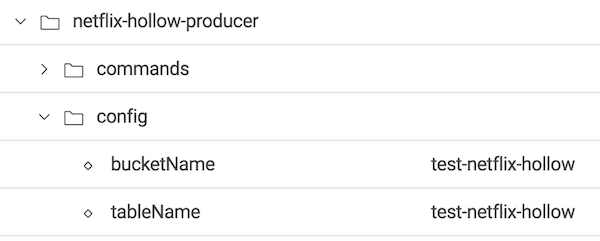
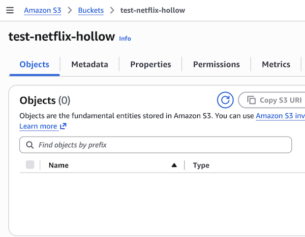
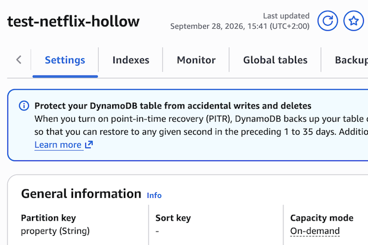
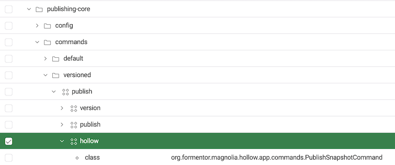
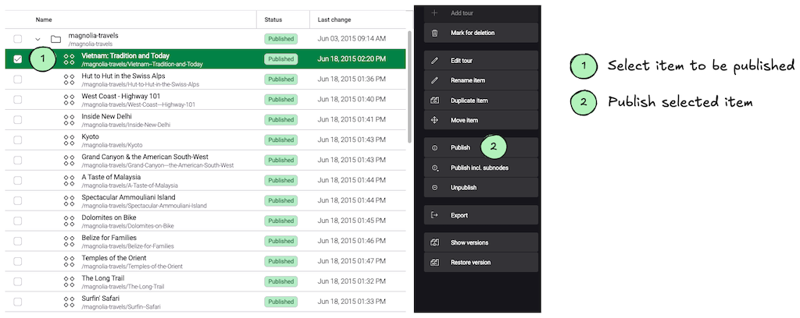

# magnolia-netflix-hollow
Distribution of contents from [Magnolia CMS](https://www.magnolia-cms.com/) with [Hollow OSS](https://hollow.how/) - in-memory compressed object database -

## ✅ Features
- Implementation of [Hollow producer](https://hollow.how/producer-consumer-apis/) to publish contents from Magnolia to [Hollow OSS](https://hollow.how/).
- Integration with Amazon S3 as Blob store of [Hollow OSS](https://hollow.how/).
- Integration with Amazon DynamoDB as Snapshot announcer of [Hollow OSS](https://hollow.how/).

## ⚙️ Setup
1. Add dependency of module `netflix-hollow-producer` to bundle of Magnolia - only **author** instance -
```xml
<dependency>
  <groupId>org.formentor.magnolia</groupId>
  <artifactId>netflix-hollow-producer</artifactId>
  <version>1.0-SNAPSHOT</version>
</dependency>
```

2. Specify Amazon S3 bucket name and DynamoDB table name in module configuration.



3. Grant access to S3 Bucket and DynamoDB table from server of Magnolia.

## 🚀 Usage
1. Create Amazon S3 Bucket `test-netflix-hollow` used as Hollow Blob Store



2. Create table `test-netflix-hollow` in Amazon DynamoDB to store current Snapshot version.
Specify `property` as _Partition key_


3. Grant access to S3 Bucket and DynamoDB table from server of Magnolia.

4. Publish contents from a Groovy script - for testing purpose -
```groovy
map = new java.util.LinkedHashMap<String, String>()
map.put("path", "/magnolia-travels/Vietnam--Tradition-and-Today")
map.put("repository", "tours")
cm = info.magnolia.commands.CommandsManager.getInstance()
cm.executeCommand('hollow', 'publish', map)
```
5. Publish contents from UI
Add command hollow to the default publication command


Publish contents from UI


## ✨ Implementation
Project structure
```
magnolia-netflix-hollow
 ├── magnolia-netflix-hollow-webapp # Bundle of Magnolia
 └── netflix-hollow-producer        # Module that integrates Magnolia with Netflix Hollow
```

Structure of module `netflix-hollow-producer`:
```
org
 └── formentor
      └── magnolia
           └── hollow
               ├── HollowProducerModule.java
               ├── app             
               │   └── commands
               │       └── PublishSnapshotCommand.java # Command that publishes contents to Hollow from UI
               ├── application     
               │   └── ContentSnapshotPublisher.java   # Use case that publishes contents to Hollow
               ├── domain
               │   ├── HollowAnnouncer.java            # Port interface for Snapshot version announcer
               │   └── HollowPublisher.java            # Port interface for Snapshot/Delta publisher
               ├── infrastructure
               │   ├── HollowAnnouncerDynamoDB.java    # Adapter of HollowAnnouncer for DynamoDB 
               │   └── HollowPublisherS3.java          # Adapter of HollowPublisher for Amazon S3
               └── setup
```